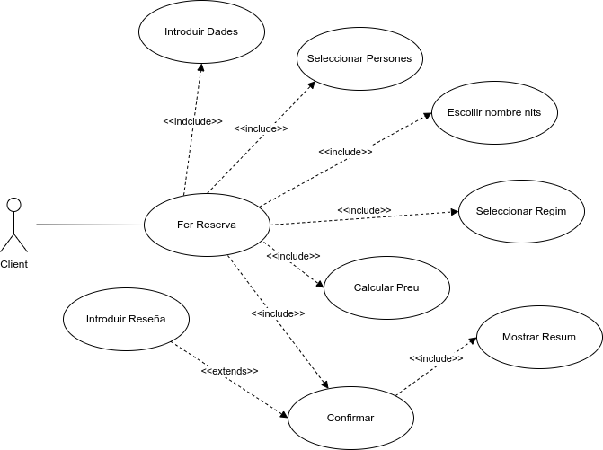
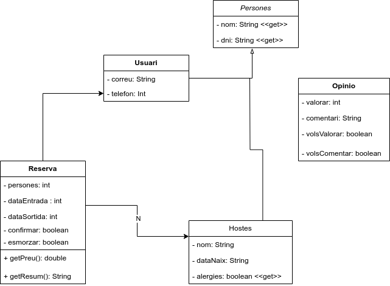
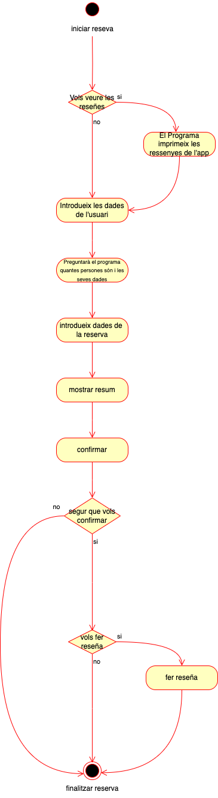

Iker Mata i Biel Domínguez - 1 DAW
# Introducció al nostre programa: Reserva d'Hotel
La nostra aplicació permet gestionar reserves en un hotel de manera senzilla i eficient. El procés de reserva s'inicia amb la introducció de les dades personals de la persona que fa la reserva, incloent-hi el DNI, el nom, el correu electrònic i el telèfon de contacte.

Un cop introduïdes aquestes dades, l'usuari ha d'indicar el nombre total de persones que s'allotjaran (màxim 5) i proporcionar el nom i el DNI de cadascuna. A continuació, se selecciona la data d'entrada i de sortida, fet que permet calcular automàticament el nombre de nits d'estada i el cost total de la reserva.

L'usuari també té l'opció d'incloure l'esmorzar en la seva estada (fet que farà que el preu de la reserva augmenti). En cas que ho faci, el sistema li demanarà si algun dels hostes té al·lèrgies alimentàries per tal de gestionar-les adequadament.

Quan tota la informació ha estat introduïda, es mostra a l'usuari el preu total de la reserva. Finalment, se sol·licita la confirmació de la reserva. Si l'usuari la confirma, les dades queden registrades i es genera un resum. Si, per contra, decideix no confirmar-la, la informació es descarta i es mostra un missatge indicant que la reserva ha estat cancel·lada correctament.

Independentment del resultat, en finalitzar el procés es convida l'usuari a deixar una ressenya sobre la seva experiència amb el sistema de reserves.
# Diagrama de de casos d'ús
El nostre sistema de reserves d’hotel permet als usuaris fer una reserva de manera senzilla. Els seus casos d’ús són els següents:

**Fer una reserva (cas d’ús principal)**, que inclou:
- **Introduir Dades:** L’usuari que fa la reserva introdueix les seves dades personals (DNI, nom, correu electrònic i telèfon).
- **Seleccionar Persones:** Seguit l’usuari introdueix el nombre de persones que s’allotjaran i les seves dades (DNI, nom) (màxim 5).
- **Seleccionar Nits:** La persona que fa la reserva introdueix la data d'entrada i la data de sortida a l'hotel.
- **Seleccionar Règim:** L’usuari tria si vol o no vol esmorzar inclòs en la reserva.
- **Calcular Preu:** El programa calcula el preu total segons les eleccions de l'usuari, i mostra un resum de la comanda amb el preu inclós.
- **Confirmar:** l’usuari un cop ha vist el resum pot confirmar o cancel·lar la reserva, si la reserva no es confirma, la informació es descarta.
  - **Introduir ressenya (extensió de Confirmar):** Si la reserva ha estat confirmada, el client té l’opció d’introduir una valoració i un comentari sobre l’experiència amb el sistema.

# Diagrama de classes
El diagrama de classes representa el sistema de reserva de l'hotel a l'hora de fer una reserva on els usuaris fan la reserva i poden deixar opinions de l'experiència de fer-la.
- **Classe Persona :**
  - La classe persona representa les dades personals que introdueix la persona
    - nom: String (nom del qual fa la reserva)
    - dni: String (document d'identitat del qual fa la reserva)
- **Classe usuari:**
  - La classe usuari representa les dades que introdueix l'usuari i és heretada de per persona.I té relació amb reserva.
    - correu: String (correu electrònic de l'usuari)
    - teléfon: Int (número de telèfon de l'usuari)
- **Classe reserva:**
  - La classe reserva tenen diferents variables i representa els atributs de la reserva
  persones: 
    - int (nombre de persones de la reserva)
    - dataEntrada: int (data d'entrada a l'hotel)
    - dataSortida: int(data de sortida de l'hotel)
    - confirmar: boolean (indica si la reserva aquesta confirmada)
    - esmorzar: boolean (si inclou desdejuni)
  - **Els mètodes de la classe:**
    - getPreu(): double (calcula el preu total de la reserva)
    - getResum(): String (retorna un resum de la reserva)
- **Classe Model.Hostes:**
  - Representa a la persona que ofereix l'allotjament.Té relació amb reserva
    - nom: String (nom de l'amfitrió)
    - dataNaix: String (data de naixement)
    - alergies: boolean(sí té alguna al·lèrgia)
- **Classe opinió:**
  - Representa una valoració feta per usuari. Té relació amb usuari
    - valorar: int (valor numèric de l'opinió
    - comentar : String (comentari de l'usuari)
    - volsValorar: boolean(indica si vol valorar)
    - volsComentar: boolean(indica si vol deixar un comentari)

# Diagrama d'activitat
El diagrama d'activitat és el procés resumit del qual farà l'usuari en fer la reserva.
Els passos són:
- **Pas 1:** El programa inicia preguntant si l'usuari vol veure les ressenyes de l'app.
  - **Opció 1 (L’USUARI DIU QUE SÍ QUE VOL):** Imprimirà en pantalla les ressenyes de les reserves anteriors.
  - **Opció 2 (L’USUARI DIU QUE NO VOL):** Passarà al pas 2 que és introduir les dades del que fa la reserva.
- **Pas 2:** L'usuari inicia la reserva i li mostrarà en pantalla les dades que ha de ficar.
- **Pas 3:** El Programa preguntarà quantes persones són a la reserva i per persona preguntarà la seva data de naixement i si té al·lèrgies o no.
- **Pas 4:** Quan l'usuari ja ha ficat totes les dades passarà a dir quantes nits es vol quedar i si volen esmorzar.
- **Pas 5:** Quan estigui tot seleccionat per l'usuari en pantalla sortirà un resum de les seves dades i els requisits de la reserva. I li donarà a confirmar.
- **Pas 6:** Després de donar a confirmar el programa dirà si està segur que vol confirmar la reserva. Li sortiran dues opcions si està segur o si no:
  - **Opció 1 (SI CONFIRMA):** Si està segur que si vol fer la reserva el codi continuarà al següent punt.
  - **Opció 2 (NO CONFIRMA):** Si l'usuari no està segur de què vol fer la reserva el programa s'acabarà i li mostrarà un missatge de què la reserva ha estat cancel·lada correctament.
- **Pas 7:** Aquest pas és si l'usuari ha dit que confirma la reserva. El programa dirà per pantalla si vull fer una ressenya de l'experiència de la reserva.
  - **Opció 1 (SÍ FER LA RESSENYA):** L'usuari podrà fer una ressenya de l'experiència de la reserva.
  - **Opció 2 (NO FA LA RESSENYA):** Si l'usuari diu que no vol fer ressenya passarà a acabar el programa.

